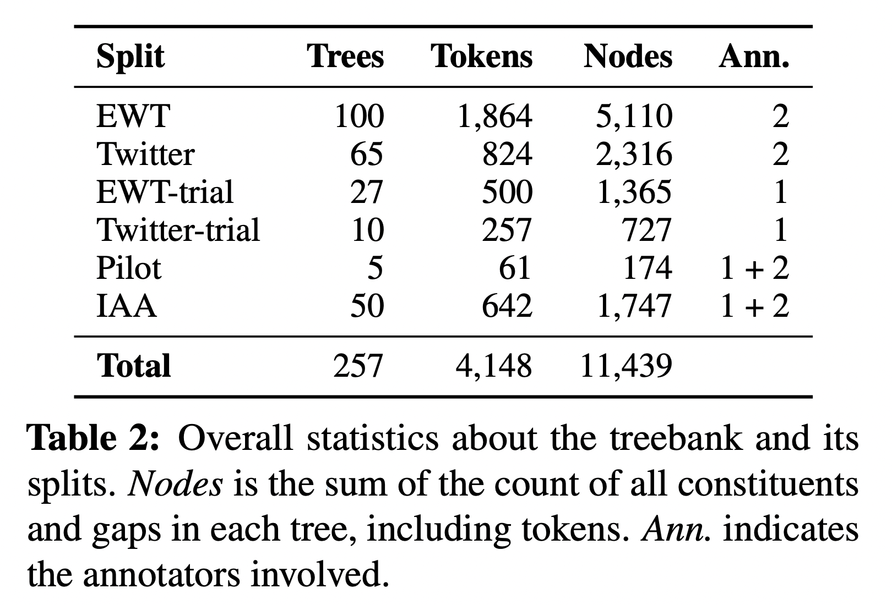
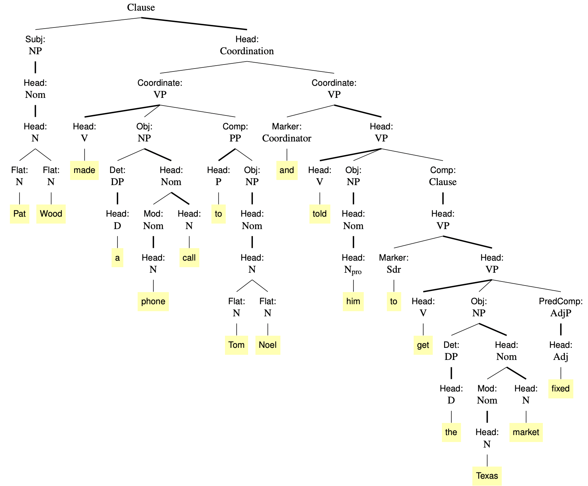

# cgel

This repo includes code for converting Universal Dependencies-formalism trees into the syntactic formalism from the *Cambridge Grammar of the English Language* (*CGEL*). CGEL gold data in the repo is annotated by Brett Reynolds (@brettrey3 on Twitter, who also runs @DailySyntaxTree).

 [![CC BY 4.0][cc-by-shield]][cc-by]

This work is licensed under a
[Creative Commons Attribution 4.0 International License][cc-by].

[![CC BY 4.0][cc-by-image]][cc-by]

[cc-by]: http://creativecommons.org/licenses/by/4.0/
[cc-by-image]: https://i.creativecommons.org/l/by/4.0/88x31.png
[cc-by-shield]: https://img.shields.io/badge/License-CC%20BY%204.0-lightgrey.svg

## Datasets
We have two portions of our resulting dataset: a small set of sentences with both gold CGEL and UD trees, and a larger set of trees from EWT with complete CGEL silver parses.

<table>
<tr>
<td></td>
<td></td>
</tr>
</table>

**The gold data resides in 4 files:**

- `datasets/{twitter.cgel, twitter.conllu}`: CGEL gold trees from Twitter with corresponding UD trees (silver from Stanza then manually corrected by Nathan Schneider)
- `datasets/{ewt.cgel, ewt.conllu}`: UD gold trees from EWT train set, with corresponding CGEL trees (manually annotated by Brett Reynolds)
- `datasets/trial/{ewt-trial.cgel, ewt-trial.conllu, twitter-etc-trial.cgel}`: Miscellaneous CGEL + UD gold trees annotated but not adjudicated by both annotators.
- **Interannotator studies** `datasets/iaa/`
  - `ewt-test_pilot5.{nschneid, brettrey, adjudicated}.cgel`: Pilot interannotator study (5 sentences from EWT).
  - `ewt-test_iaa50.{...}.cgel`: Main interannotator study (50 sentences from EWT).
    - `{nschneid, brettrey}.novalidator`: Initial annotation.
    - `{nschneid, brettrey}.validator`: Corrected individual annotation after running automatic validation script to catch common errors.
    - `adjudicated`: Final adjudicated version combining both annotations.

Both portions were revised with the aid of consistency-checking scripts.

Other subdirectories contain older/silver versions of the trees.

To load the CGEL trees for scripting, use the `cgel.py` library.

## Structure
- `cgel.py`: library that implements classes for CGEL trees and the nodes within them, incl. helpful functions for printing and processing trees in PENMAN notation
- `cgel2ptb.py`: prints CGEL trees in PTB style
- `constituent.py`: information about how constituents join in a tree, for use by other scripts
- `eval.py`: script for comparing two sets of CGEL annotations with tree edit distance (and derived metrics)
- `iaa.sh`: script that runs `eval.py` on all files involved in our interannotator study (comparing pre- and post-validation trees as well as final adjudicated version)
- `tree2tex.py`: print CGEL trees in pretty LaTeX
- `ud2cgel.py`: converts UD trees (from English EWT treebank) to CGEL format using rule-based system
- `validate_trees.py`: script to check the well-formedness of trees

**Folders**
- `analysis/`: scripts for analysing the datasets, incl. edit distance
- `convertor/`: includes conversion rules in DepEdit script + outputs from conversion, with a simple Flask web interface for local testing in the browser (English text > automatic UD w/ Stanza > CGEL)
- `datasets/`: all the final output datasets, incl. gold UD for the gold CGEL data (more detailed description TBD)
- `figures/`: figures for papers/posters and code for generating them
- `scripts/`: one-off scripts that were used to clean/restructure data
- `test/`: validation tests

## Tests

To run tests locally:

```sh
$ python -m pytest
```

This will validate the trees and test distance metrics (Levenshtein and TED).

## History

- CGELBank 1.0: 2023-07-04.
  - Initial release of 257 trees.

## Resources

__Overview of the project:__

Brett Reynolds, Aryaman Arora, and Nathan Schneider (2023). [Unified Syntactic Annotation of English in the CGEL Framework](https://people.cs.georgetown.edu/nschneid/p/cgeltrees.pdf). *Proc. of the 17th Linguistic Annotation Workshop (LAW-XVII)*, Toronto, Canada.

```bibtex
@inproceedings{cgelbank-law,
    address = {Toronto, Canada},
    title = {Unified Syntactic Annotation of {E}nglish in the {CGEL} Framework},
    author = {Reynolds, Brett and Arora, Aryaman and Schneider, Nathan},
    year = {2023},
    month = jul,
    url = {https://people.cs.georgetown.edu/nschneid/p/cgeltrees.pdf},
    booktitle = {Proc. of the 17th Linguistic Annotation Workshop (LAW-XVII)}
}
```

__Annotation manual:__

Brett Reynolds, Nathan Schneider, and Aryaman Arora (2023). [CGELBank Annotation Manual v1.0](https://arxiv.org/abs/2305.17347). *arXiv*.

__Further analysis:__

Brett Reynolds, Aryaman Arora, and Nathan Schneider (2022). [CGELBank: CGEL as a Framework for English Syntax Annotation](http://arxiv.org/abs/2210.00394). *arXiv*.

Aryaman Arora, Nathan Schneider, and Brett Reynolds (2022). [A CGEL-formalism English treebank](https://docs.google.com/presentation/d/1muLMZyNLspXElkWaOLfGQve64SxbapXkXJpWpgNmFWw/edit). *MASC-SLL* (poster), Philadelphia, USA.

__Source data:__

Natalia Silveira, Timothy Dozat, Marie-Catherine de Marneffe, Samuel Bowman, Miriam Connor, John Bauer, Chris Manning (2014). [A Gold Standard Dependency Corpus for English](https://aclanthology.org/L14-1067/). *Proc. of the Ninth International Conference on Language Resources and Evaluation (LREC '14)*.

Ann Bies, Justin Mott, Colin Warner, Seth Kulick (2012). [English Web Treebank](https://catalog.ldc.upenn.edu/LDC2012T13). *LDC*.